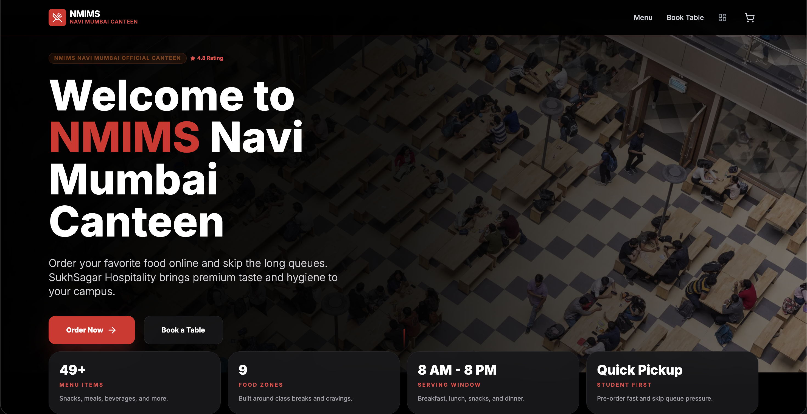
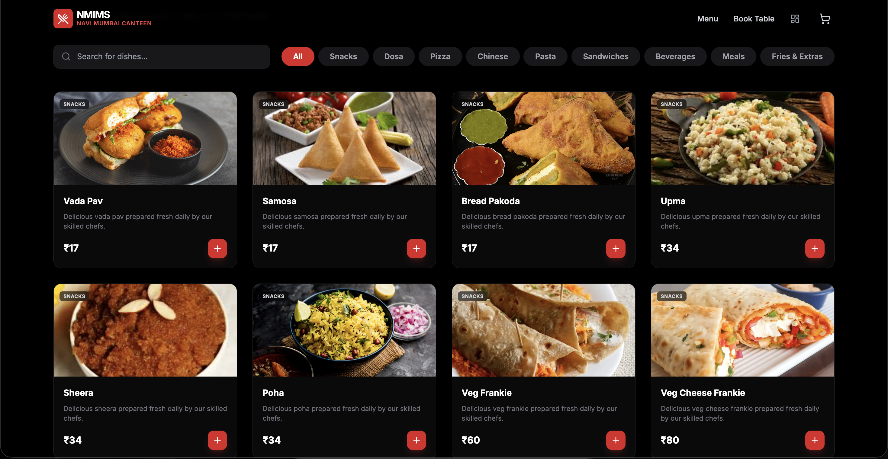
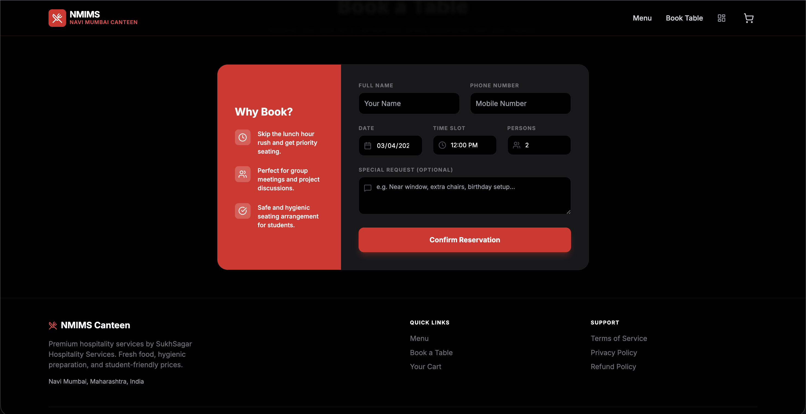
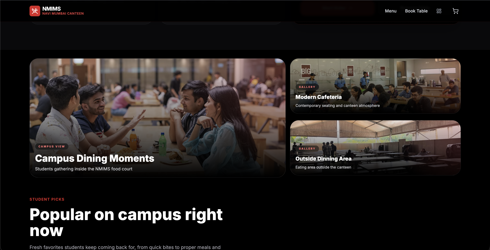
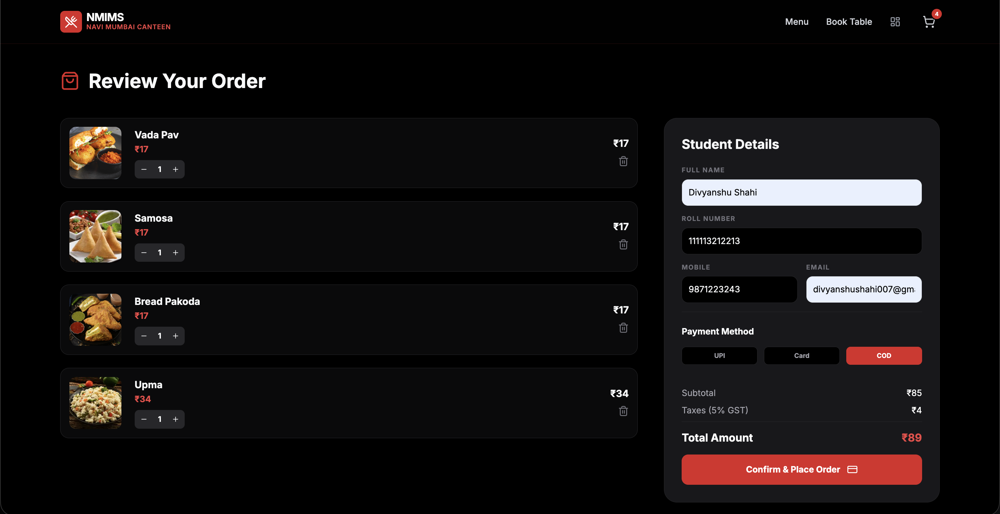

# NMIMS Navi Mumbai Canteen

A responsive canteen ordering app for NMIMS Navi Mumbai built with React, TypeScript, and Vite. Students can browse the menu, add items to cart, place an order, and reserve tables, while staff can manage orders, bookings, and menu items from a simple admin dashboard.

<p align="center">
  
</p>

## Highlights

- 49 menu items across 9 categories
- Fast menu browsing with search and category filters
- Cart flow with quantity controls, GST calculation, and checkout form
- Table booking flow with date, time slot, party size, and special requests
- Admin dashboard for order updates, booking approvals, menu edits, and CSV export
- Browser-based persistence using `localStorage`
- `HashRouter` routing, which makes the app friendly for static hosting

## Tech Stack

- React 19
- TypeScript
- Vite
- React Router
- Lucide React
- Tailwind CSS via CDN

## Screenshots

<p align="center">
  
  
</p>

<p align="center">
  
  
</p>

## Features

### Student Experience

- Browse a large food catalog with image cards, prices, and categories
- Search dishes instantly from the menu page
- Add items to cart and adjust quantities before checkout
- Submit order details with name, roll number, email, mobile number, and payment method
- Book a table with preferred date, time slot, party size, and optional notes

### Admin Experience

- View incoming orders and update their status
- Review bookings and approve or reject reservations
- Add new menu items and remove outdated ones
- Export orders and bookings as CSV reports

## Getting Started

### Prerequisites

- Node.js
- npm

### Run Locally

```bash
npm install
npm run dev
```

The development server usually starts at `http://localhost:5173`.

### Production Build

```bash
npm run build
npm run preview
```

## Project Structure

```text
.
├── App.tsx
├── assets/
├── pages/
├── constants.tsx
├── types.ts
├── index.tsx
└── index.css
```

## Notes

- Orders, bookings, and menu changes are stored in the browser with `localStorage`; there is no backend database in this version.
- Admin authentication is currently demo-only and hardcoded in `pages/AdminDashboard.tsx`. Replace it before deploying publicly.
- Several food and gallery images are loaded from external URLs, so a network connection is still needed for some visual assets.

